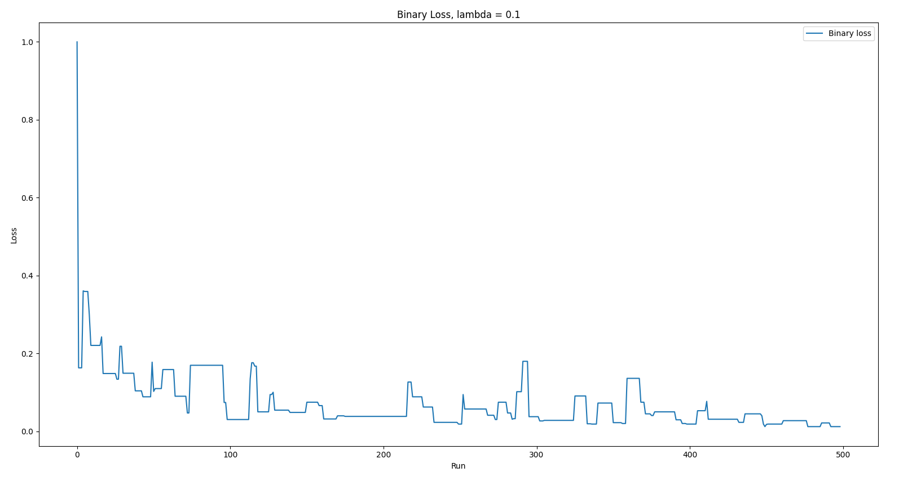
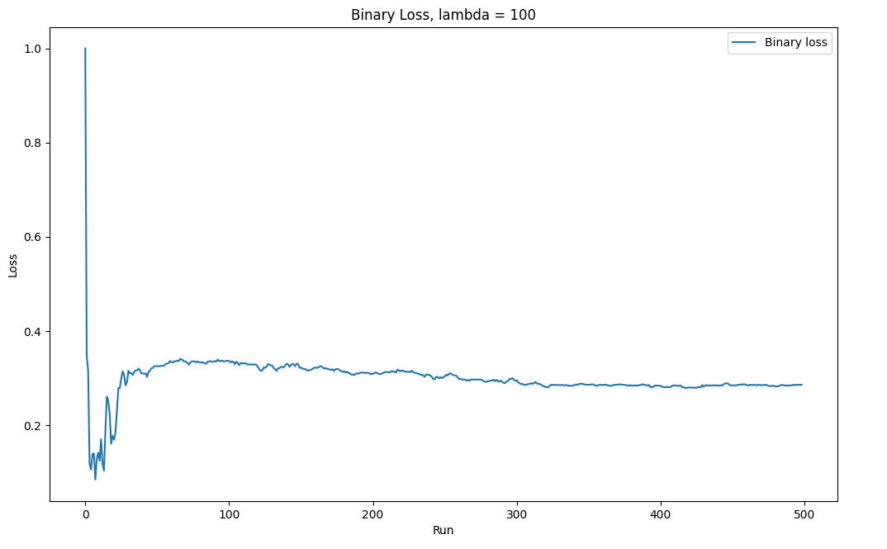
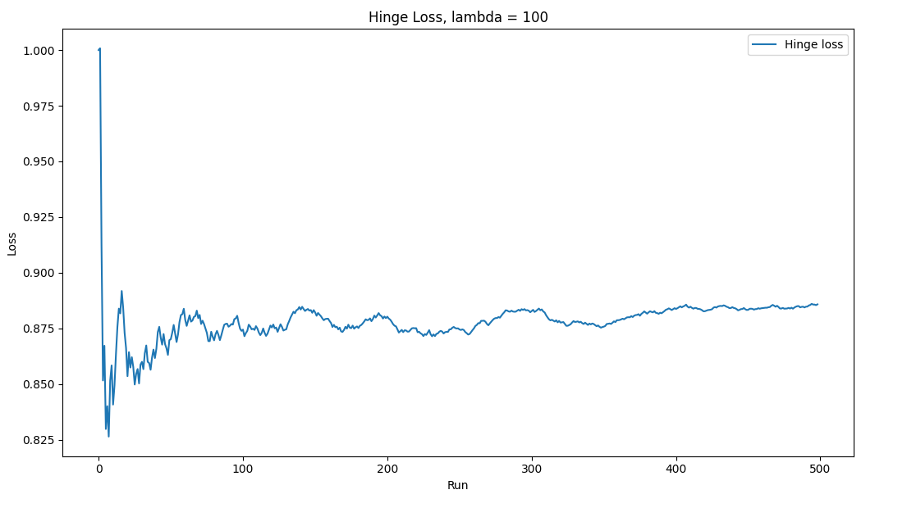

# banknote-auth
Trained a linear predictor on the banknote data set from the UCI repository to determine banknote authenticity

Some preformance results with varying hyperparameter values:

![hin0.1(banknote-auth/hingeL0.1.png)

